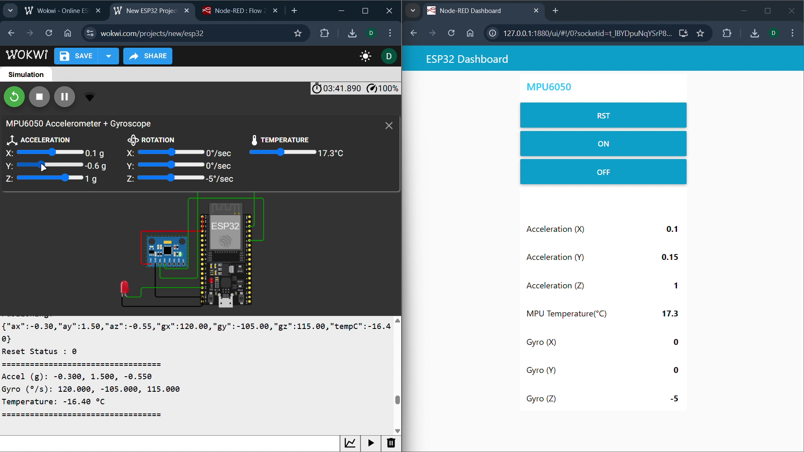
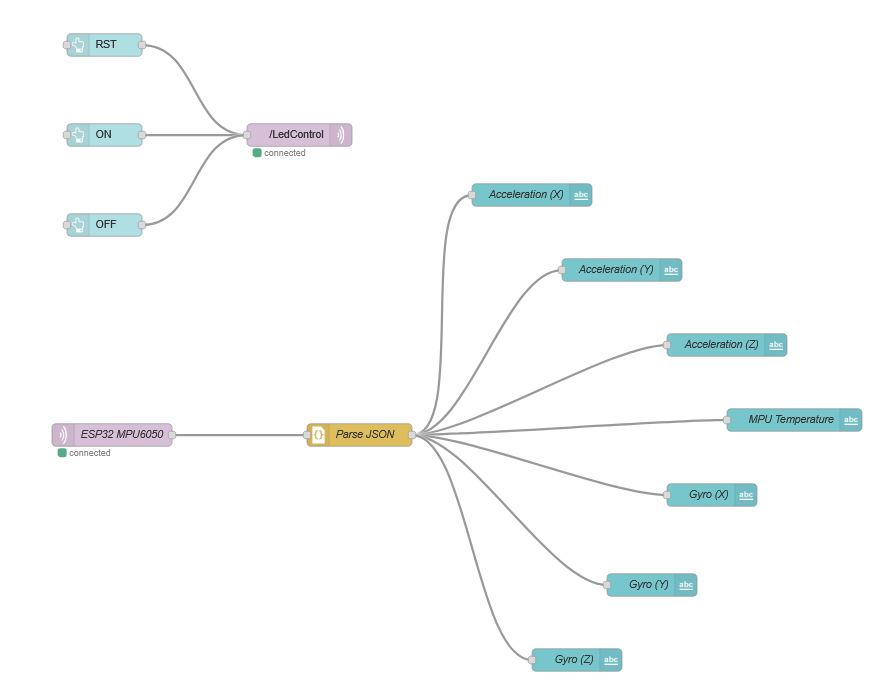

# 📡 ESP32 + MPU6050 + MQTT + Node-RED Dashboard 🌐

This project demonstrates how to interface an **MPU6050 (Accelerometer + Gyroscope)** sensor with an **ESP32**, send real-time motion and temperature data to an **MQTT broker (HiveMQ)**, and visualize/control everything from a **Node-RED Dashboard** 🎛️.

It also includes a **remote LED control** 💡 and **sensor reset function** 🔄 through MQTT.

<video width="480" controls>
  <source src="video2.mp4" type="video2/mp4">
  Your browser does not support the video tag.
</video>

---

## 🎥 Project Video

Watch the demo video here:  


---

## 🖼️ Project Photos

  
  

---

## ✨ Key Features

✅ **Wi-Fi + MQTT Communication**  
- ESP32 connects automatically to `broker.hivemq.com` 🌍  
- Publishes MPU6050 sensor data every 2 seconds → `home/sensor/mpu6050`  
- Subscribes to control topics:
  - `/LedControl` → 💡 Turn LED ON/OFF  
  - `/Rest` → 🔁 Reset all sensor readings  

📊 **Sensor Readings Include:**
- Accelerometer (X, Y, Z)
- Gyroscope (X, Y, Z)
- Temperature (°C)

⚙️ **Node-RED Dashboard Functions:**
- Live graphs for motion data 📈  
- Buttons for LED ON/OFF 🔘  
- Button to Reset Sensor Readings 🔄  

---

## 🧠 Hardware Components

| 🧩 Component | 📝 Description |
|--------------|----------------|
| 🧠 **ESP32** | WiFi + MQTT-enabled microcontroller |
| 🎯 **MPU6050** | 3-axis Accelerometer & Gyroscope |
| 💡 **LED** | Status indicator (GPIO 9) |
| 🔌 **Jumper Wires** | For I2C connections (SDA=21, SCL=22) |

---

## ⚡ Pin Connections

| ESP32 Pin | MPU6050 Pin | Function |
|------------|-------------|-----------|
| 3.3V | VCC | Power supply |
| GND | GND | Ground |
| GPIO 21 | SDA | I²C Data |
| GPIO 22 | SCL | I²C Clock |

---

## 💬 MQTT Topics Overview

| 🧵 Topic | 🔁 Direction | 💡 Description |
|----------|---------------|----------------|
| `home/sensor/mpu6050` | 📤 Publish | JSON sensor readings |
| `/LedControl` | 📥 Subscribe | LED control → `'1'` = ON, `'2'` = OFF |
| `/Rest` | 📥 Subscribe | Reset sensor readings → `'3'` |

---

## 🧩 Node-RED Flow Setup

🧱 Example Flow:
1. **MQTT IN node** → Subscribe to `home/sensor/mpu6050`  
2. **JSON node** → Parse incoming sensor JSON  
3. **Dashboard chart** → Show real-time Accelerometer & Gyro data  
4. **MQTT OUT nodes** → Send control commands to `/LedControl` or `/Rest`  

💡 Use buttons or switches on your dashboard to:
- Turn LED ON/OFF  
- Reset sensor values  

---

## 🖥️ Sample Output (Published JSON)

```json
{
  "ax": 0.12,
  "ay": -0.03,
  "az": 0.99,
  "gx": 0.14,
  "gy": -0.21,
  "gz": 0.07,
  "tempC": 28.65
}
